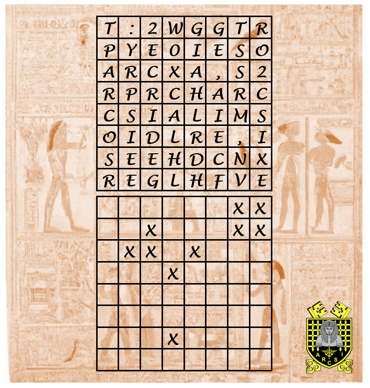
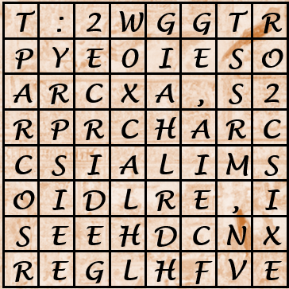
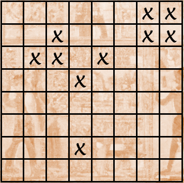
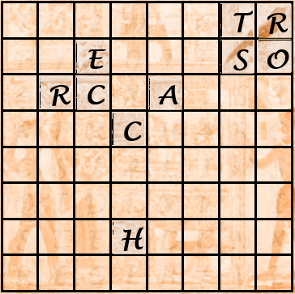
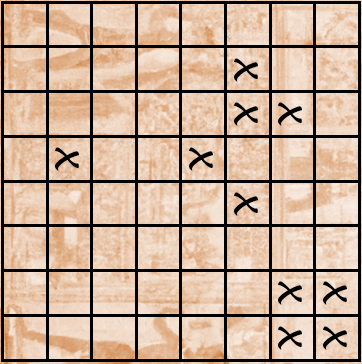
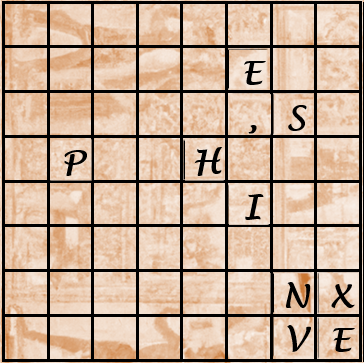
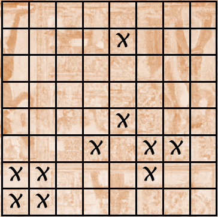
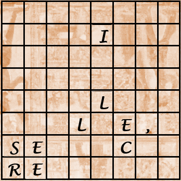
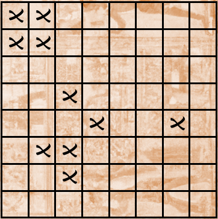
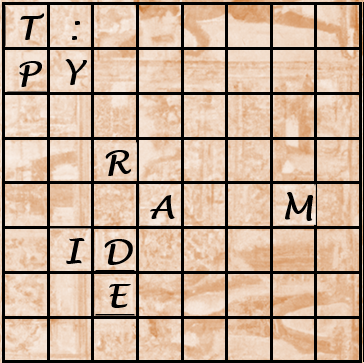

# Crypto challenges
## Table of contents
- [crazycrypto3kids (28 solves)](./crypto.md#crazycrypto3kids)
- [bitcoin (11 solves)](./crypto.md#bitcoin)

### crazycrypto3kids
<!--
```
```
-->
**Attachements :**
- [papyrus_message2.PNG](./assets/attachments/papyrus_message2.PNG)

#### Solution
We first open the image to see what it is.<br>
<br>
Here we see two matrixes, one with letters and the other with crosses.<br>
My first guess was to follow the matrix with the crosses (that I will now call the key matrix) on the letters matrix.<br>
So we do this combination :<br>

<br>
And so we can see<br>
 TRESORCACH<br>
Which can be translated in HIDDENTREASUR<br>
So here, I was thinking that we needed an E to continue this sentence, so I tried to find a way to find a E that would be on a cross in the key matrix.<br>
The idea I got was to flip the key matrix, so it looks now like this :<br>
<br>
And, if replace each cross by its place in the original matrix, we have :<br>
E,SPHINXVE<br>
This seems to be french and we have our E ! Let's try to flip this two more time to have te key matrix flipped in every side<br>

ILLE,SECRE<br>

T:PYRAMIDE<br><br>

If we now take every bit of sentence we got by doing these flippy things, we get the message :<br>
`TRESORCACHE,SPHINVEILLE,SECRET:PYRAMIDE`<br>
Which, if you add the syntax, is our flag !<br>
#### Flag
```
brb{TRESORCACHE,SPHINVEILLE,SECRET:PYRAMIDE}
```
<br><br><br><hr>

### bitcoin
```
Find the private key from the public key :
1DKkz3P7mA8Y9GTpZPFw9GvDVWeEp9v5vU
```
Disclaimer : This is not exactly what was written on Barbhack CTF, but as we don't have the sources anymore I just write what I remember.<br>
**Attachements :**
- `bitcoin.zip` (deleted the archive, if you have it contact me)

#### Solution
So first we extract the archive (I'm on Linux) :
```bash
unzip bitcoin.zip
```
We can see in this extraction that we are extracting things from a folder called `.git`<br>
This means that there is a git repository, so surely that some informations can be accessed from it.<br>
In this archive, we can see that there only one Python file (and the hidden `.git` folder that we will use later).<br>
This python file is `arsci_challenge.py` and contains :
```py
import cryptos
import numpy as np

valid_private_key = False
while not valid_private_key:
    base_key = '0000000000000000000000000000000000000000000000000000000000000000'
    decoded_base_key = cryptos.decode_privkey(base_key, 'hex')
    shitty_random_number = np.random.randint(2**16-1, dtype=np.uint16)
    decoded_private_key = decoded_base_key + shitty_random_number
    private_key = cryptos.encode_privkey(decoded_private_key, 'hex')
    valid_private_key = 0 < decoded_private_key < cryptos.N

print("Private Key (hex) is: ", private_key)
print("Private Key (decimal) is: ", decoded_private_key)

wif_encoded_private_key = cryptos.encode_privkey(decoded_private_key, 'wif')
print("Private Key (WIF) is: ", wif_encoded_private_key)

compressed_private_key = private_key + '01'
print("Private Key Compressed (hex) is: ", compressed_private_key)

wif_compressed_private_key = cryptos.encode_privkey(
    cryptos.decode_privkey(compressed_private_key, 'hex'), 'wif_compressed')
print("Private Key (WIF-Compressed) is: ", wif_compressed_private_key)

public_key = cryptos.fast_multiply(cryptos.G, decoded_private_key)
print("Public Key (x,y) coordinates is:", public_key)

# Encode as hex, prefix 04
hex_encoded_public_key = cryptos.encode_pubkey(public_key, 'hex')
print("Public Key (hex) is:", hex_encoded_public_key)

(public_key_x, public_key_y) = public_key
compressed_prefix = '02' if (public_key_y % 2) == 0 else '03'
hex_compressed_public_key = compressed_prefix + (cryptos.encode(public_key_x, 16).zfill(64))
print("Compressed Public Key (hex) is:", hex_compressed_public_key)

print("Bitcoin Address (b58check) is:", cryptos.pubkey_to_address(public_key))

print("Compressed Bitcoin Address (b58check) is:",
      cryptos.pubkey_to_address(hex_compressed_public_key))
```
Ok... It seems to talk about bitcoin.. Not something I'm really familiar with. Let's execute the code once to see what it does :
```
Private Key (hex) is:  8a650c74f99596370fb8b7ac90875130996b432adf80e341dff13a7ec1fed38e
Private Key (decimal) is:  62597710632627650345609992609085463007566398588575234349159900150035000513422
Private Key (WIF) is:  5JsEgunFix8nWqkxSbrJqdKXJiX48oVXe5U4JSDAsnfESXZewBN
Private Key Compressed (hex) is:  8a650c74f99596370fb8b7ac90875130996b432adf80e341dff13a7ec1fed38e01
Private Key (WIF-Compressed) is:  2SvnWDcZ2jJGsDEt27xDF99FNA4ffznFbyFTqSSxNZo4iBw43T5ijs
Public Key (x,y) coordinates is: (78447178609861575517313532831318518306186309080292566090629670673926534371828, 84778663329634503620630195145419404616416592712192101549297838472304792329308)
Public Key (hex) is: 04ad6f879609a8da75f8b607d27bd907951857bdd079fdeb854ea75b1d222699f4bb6f05e2b181a49299a0df626baaac3c936fc5fc3f6db2ca917309f28e4a5c5c
Compressed Public Key (hex) is: 02ad6f879609a8da75f8b607d27bd907951857bdd079fdeb854ea75b1d222699f4
Bitcoin Address (b58check) is: 14vyGHUV1UoiWKyFH7ouTqWaACKNK16cPH
Compressed Bitcoin Address (b58check) is: 1GptJfMSmtbncnKLaXaMTs5rW44GrqyRSq
```
What I understand is that it generates a private key and a public key for something, I don't know what is the purpose of it yet.<br><br>
Let's check the git repository.<br>
To see if there has been some commits, we can use this command :
```bash
git log
```
We see that there are indeed some changes. After checking that the oldest commit has the most informations (`git log -p`), let's check this commit :
```bash
git checkout 890ae36
```
Now we can see a slightly different `arcsi_challenge.py` file, as it has now descriptions and, more importantly, the base_key :
```py
import cryptos
import numpy as np

# Generate a random private key
valid_private_key = False
while not valid_private_key:
    # The base key was found by a single call to cryptos.random_key()
    # Its presence will ensure the generated address is not in the list of
    # know weak addresses (i.e. the addresses whose private keys are in [0: 2**32-1]).
    # The base key must be disclosed to the challenge participants for them to find the
    # key.
    base_key = '8a650c74f99596370fb8b7ac90875130996b432adf80e341dff13a7ec1fe0e34'
    decoded_base_key = cryptos.decode_privkey(base_key, 'hex')
    shitty_random_number = np.random.randint(2**16-1, dtype=np.uint16)
    decoded_private_key = decoded_base_key + shitty_random_number
    private_key = cryptos.encode_privkey(decoded_private_key, 'hex')
    valid_private_key = 0 < decoded_private_key < cryptos.N

print("Private Key (hex) is: ", private_key)
print("Private Key (decimal) is: ", decoded_private_key)

# Convert private key to WIF format
wif_encoded_private_key = cryptos.encode_privkey(decoded_private_key, 'wif')
print("Private Key (WIF) is: ", wif_encoded_private_key)

# Add suffix "01" to indicate a compressed private key
compressed_private_key = private_key + '01'
print("Private Key Compressed (hex) is: ", compressed_private_key)

# Generate a WIF format from the compressed private key (WIF-compressed)
wif_compressed_private_key = cryptos.encode_privkey(
    cryptos.decode_privkey(compressed_private_key, 'hex'), 'wif_compressed')
print("Private Key (WIF-Compressed) is: ", wif_compressed_private_key)

# Multiply the EC generator point G with the private key to get a public key point
public_key = cryptos.fast_multiply(cryptos.G, decoded_private_key)
print("Public Key (x,y) coordinates is:", public_key)

# Encode as hex, prefix 04
hex_encoded_public_key = cryptos.encode_pubkey(public_key, 'hex')
print("Public Key (hex) is:", hex_encoded_public_key)

# Compress public key, adjust prefix depending on whether y is even or odd
(public_key_x, public_key_y) = public_key
compressed_prefix = '02' if (public_key_y % 2) == 0 else '03'
hex_compressed_public_key = compressed_prefix + (cryptos.encode(public_key_x, 16).zfill(64))
print("Compressed Public Key (hex) is:", hex_compressed_public_key)

# Generate bitcoin address from public key
print("Bitcoin Address (b58check) is:", cryptos.pubkey_to_address(public_key))

# Generate compressed bitcoin address from compressed public key
print("Compressed Bitcoin Address (b58check) is:",
      cryptos.pubkey_to_address(hex_compressed_public_key))
```

Now that we have the base key and a bit of explanations on how this script works, let's see what compose the private key.<br>
We can see at line 15:
```py
decoded_private_key = decoded_base_key + shitty_random_number
```
So we have the base key already, but what is `shitty_random_number` ? It's assigned at line 14 :
```py
shitty_random_number = np.random.randint(2**16-1, dtype=np.uint16)
```
Which means that `shitty_random_number` is a number between 0 and 65536 (2**16)... This is bruteforceable !<br>
But how to check that our input is the good one ?<br>
We have been given a public key : `1DKkz3P7mA8Y9GTpZPFw9GvDVWeEp9v5vU`<br>
So we just have to check if this public key matches by doing a little script :
```py
import cryptos

# Generate a random private key
given_public_key = '1DKkz3P7mA8Y9GTpZPFw9GvDVWeEp9v5vU'
for i in range(2**16):
    valid_private_key = False
    while not valid_private_key:
        # The base key was found by a single call to cryptos.random_key()
        # Its presence will ensure the generated address is not in the list of
        # know weak addresses (i.e. the addresses whose private keys are in [0: 2**32-1]).
        # The base key must be disclosed to the challenge participants for them to find the
        # key.
        base_key = '8a650c74f99596370fb8b7ac90875130996b432adf80e341dff13a7ec1fe0e34'
        decoded_base_key = cryptos.decode_privkey(base_key, 'hex')
        shitty_random_number = i
        print(i)
        decoded_private_key = decoded_base_key + shitty_random_number
        private_key = cryptos.encode_privkey(decoded_private_key, 'hex')
        valid_private_key = 0 < decoded_private_key < cryptos.N

    ...

    # Generate bitcoin address from public key
    final_public_key = cryptos.pubkey_to_address(public_key)
    if final_public_key == given_public_key:
        print("Found same public key. Private key is : " + private_key)
        break
```
And here is the output :
```
0
1
2
3
...
41454
41455
41456
Found same public key. Private key is : 8a650c74f99596370fb8b7ac90875130996b432adf80e341dff13a7ec1feb024
```
So the `shitty_random_number` was `41456` and the private key was `8a650c74f99596370fb8b7ac90875130996b432adf80e341dff13a7ec1feb024` which is our flag !
#### Flag
```
brb{8a650c74f99596370fb8b7ac90875130996b432adf80e341dff13a7ec1feb024}
```
