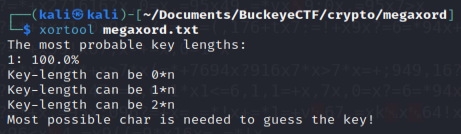
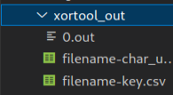
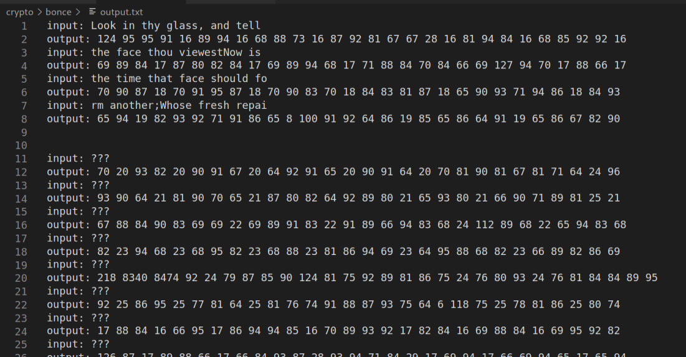
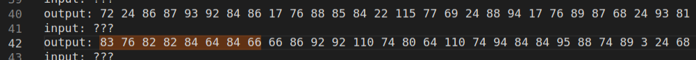

# Crypto challenges
## Table of contents
- [megaxord (312 solves)](./crypto.md#megaxord)
- [bonce (97 solves)](./crypto.md#bonce)

### megaxord
```
Some pesky wizard stole the article I was writing. I got it back, but it's all messed up now :(

Hint: the wizard used the same magic on every character...
```
**Attachements :**
- [megaxord.txt](https://github.com/cscosu/buckeyectf-2022-public/blob/master/crypto/megaxord/megaxord.txt)

#### Solution
Let's first download the megaxord.txt and see what it is behind.<br>
<br>
Pretty weird stuff.<br>
As we don't have any source code or whatever, let's see what we can retrieve on this challenge.<br>
`megaxord` is a hint in itself, as it contains XOR. The challenge could be to find the XOR key to decrypt the .txt<br>
To find a XOR, we have a wonderful tool : [xortool](https://github.com/hellman/xortool)<br>
So we can try to use `xortool` on this `megaxord.txt` :<br>
<br>
So we know that it is a key composed of only 1 character, and `xortool` asks us to provide the most possible char (under `-c`).<br>
What is the most possible in our char ? As we know it is a .txt, the most possible char is `20`. So let's try :<br>
<br>
Looks like `xortool` found our key : `X` !<br>
It even creates a folder :<br>
<br>
Let's read `0.out` :<br>
<br>
It's a Wikipedia page ! But is our flag in here ? Let's `Ctrl+F` to search for `buckeye`<br>
<br>
Of course our flag is here !
<br><br><br><hr>

### bonce
```
nonce without a cipher
```
**Attachements :**
- [output.txt](https://github.com/cscosu/buckeyectf-2022-public/blob/master/crypto/bonce/output.txt)
- [bonce.py](https://github.com/cscosu/buckeyectf-2022-public/blob/master/crypto/bonce/bonce.py)

#### Solution
First we open the `output.txt` file to see what is in there.<br>
<br>
Ok, so there is some lines with everytime an input and an output. We then check the source code to have this `output.txt` file, `bonce.py`.<br>
There are some random used, but it seems not to be in the encryption process :
```python
encrypted = []
for i in range(len(samples)):
    x = samples[i]
    if i < 10:
        nonce = str(i) * 28
    else:
        nonce = str(i) * 14
    encrypted.append(''.join(str(ord(a) ^ ord(b)) + ' ' for a,b in zip(x, nonce)))
```
`samples` is composed by
- `samples.txt`, which is a file that we don't have.
- the flag that we obviously don't have.
- Some random numbers

and its total is 40, as we can see from this part of the code :
```python
with open('sample.txt') as file:
    line = file.read()

with open('flag.txt') as file:
    flag = file.read()

samples = [line[i:i+28] for i in range(0, len(line) - 1 - 28, 28)]

samples.insert(random.randint(0, len(samples) - 1), flag)

i = 0
while len(samples) < 40:
    samples.append(samples[len(samples) - i - 2])
    i = random.randint(0, len(samples) - 1)
```
So we can see in the encryption system that it uses XOR.
```python
# The ^ symbol means XOR
encrypted.append(''.join(str(ord(a) ^ ord(b)) + ' ' for a,b in zip(x, nonce)))
```

So we need to find a way to reverse the encryption.<br>
First, we can maybe try to know where the flag is, as we know that the flag is one line in the `output.txt` file.<br>
As we know that the flag begins with `buckeye{`, we can try what it can renders when we pass `buckeye{` in the encryption system.<br>
To do that, I wrote a bit of code that I've named `findFlagId.py` :
```python
encrypted = []
for i in range(40):
    x = "buckeye{"

    if i < 10:
        nonce = str(i) * 28
    else:
        nonce = str(i) * 14
    
    nonce = str(i) * 14
    encrypted.append(''.join(str(ord(a) ^ ord(b)) + ' ' for a,b in zip(x, nonce)))

for i in range(len(encrypted)):
    print(str(i) + ": " + encrypted[i])
```
We can see this output :<br>
<br>
And it goes to line 39. Now we try to `Ctrl+F` in `output.txt` every line and see if we can get something.<br>
And...<br>
<br>
We found it. It's the index `19`, so `i > 10`.<br>
So now, we have to decrypt `83 76 82 82 84 64 84 66 66 86 92 92 110 74 80 64 110 74 94 84 84 95 88 74 89 3 24 68`<br>
Insane. But how to do that ?<br>
Let's create a `decrypt.py`. The script below is all explained by comments :
```python

#DECRYPT
# i of the flag. We'll use the same i as it is XOR
i = 19
# encrypted flag
xEncrypted = "83 76 82 82 84 64 84 66 66 86 92 92 110 74 80 64 110 74 94 84 84 95 88 74 89 3 24 68"

# nonce is defined in the encryption process. As i > 10, nonce = str(i) * 14.
nonce = str(i) * 14

# we convert the encrypted flag to a string
xEncrypted = xEncrypted.split(" ")
xEncrypted = ''.join(chr(int(el)) for el in xEncrypted)

# in XOR, if a ^ b = c, then c ^ b = a.
# Here, a is the flag and c the encrypted flag.
# So we just have to replace the real flag that we don't know by the encrypted flag.
decrypted = ''.join(str(ord(a) ^ ord(b)) + ' ' for a,b in zip(xEncrypted, nonce))

# We translate the string of form "45 68 97 ..." to a real string
decrypted = decrypted.split(" ")
decrypted = ''.join(chr(int(el)) for el in decrypted[:-1]) # here we don't take the last index because it's an empty char

# PRINT THE FLAG !!!!
print(decrypted)
```

And eventually, we execute the code :<br>
<br>
And here is the last flag that I got in this CTF !
