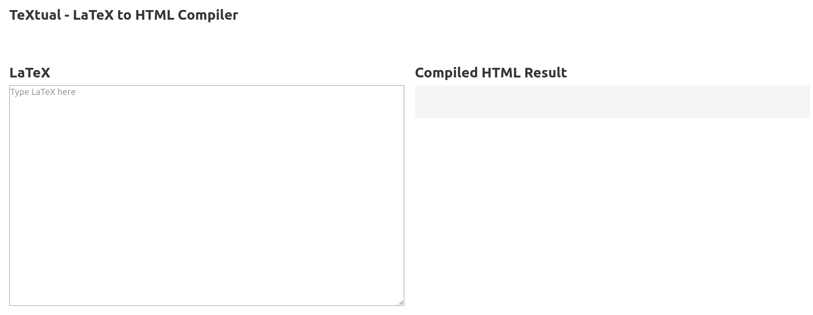
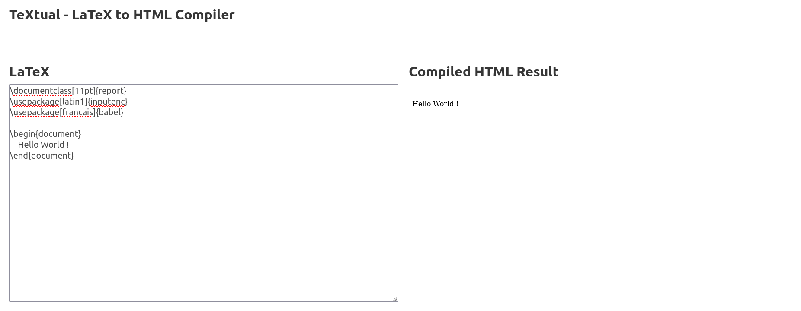
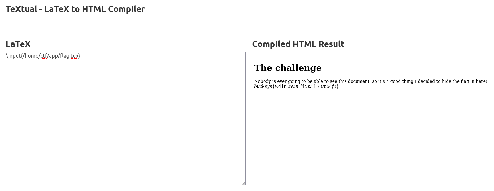

# Web challenges
## Table of contents
- [textual (214 solves)](./web.md#textual)
- [owl (153 solves)](./web.md#owl)
- [quizbot (69 solves)](./web.md#quizbot)

### textual

```
I made a LaTeX to HTML converter. Why? Because I believe in more than WYSIWYG. Don't worry though, it's totally safe!

https://textual.chall.pwnoh.io
```
**Attachements :**
- [textual.zip](https://github.com/cscosu/buckeyectf-2022-public/tree/master/web/textual/deploy) (with a fake flag in `flag.tex`)

#### Solution
We first click on the link provided, to discover the website.<br>

Ok, so it is a compiler of LaTeX. We can run it by doing `CTRL+S`

Pretty cool. Now, what about the attached file ?<br>
We can unzip the textual.zip file. It contains all of the source code of the website. We can also observe that there is a `flag.tex` in the app's root.<br>
We can think that we want to read the `flag.tex` thanks to the latex compiler.<br>
A quick research on Internet leads us to `\input{filename}` function.<br>
We know the flag location thanks to the Dockerfile :
```dockerfile
...
WORKDIR /home/ctf/app
COPY package* ./
RUN npm i
RUN cp /bin/sh /bin/sh-orig
COPY . ./
...
```
So we know that the `flag.tex` is under `/home/ctf/app/flag.tex`<br>
So we try to `\input` :

Here's the flag !


### owl


### quizbot

