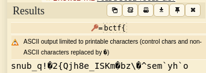
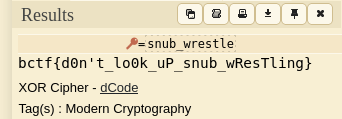
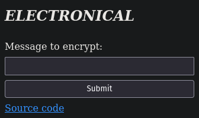
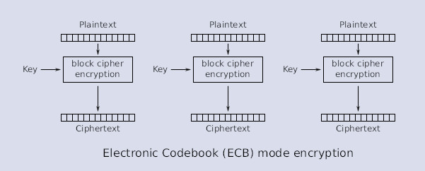

# Crypto challenges
## Table of contents
- [Secret Code (186 solves)](./crypto.md#secret-code)
- [Electronical (143 solves)](./crypto.md#electronical)
- [Real Smooth (65 solves)](./crypto.md#real-smooth)

## Secret Code
Here's your flag again:<br>
`1:10:d0:10:42:41:34:20:b5:40:03:30:91:c5:e1:e3:d2:a2:72:d1:61:d0:10:e3:a0:43:c1:01:10:b1:b1:b0:b1:40:9`<br>
LOL you `snub_wrestle`. Good luck trying to undo my xor key I used on each character of the flag.

### Solution
This one was fairly simple if you know how to XOR.<br>
We will use [dcode](https://www.dcode.fr/chiffre-xor) during this challenge. It is a good online tool to XOR strings using a key.<br>
This XOR attack is very simple because we already know a bit of plaintext: `bctf{`. We will use this to our advantage to discover and guess the XOR key used on each character.<br>
First thing to do is to delete all of the semicolon `:` in the encoded flag. It gives us `110d01042413420b540033091c5e1e3d2a272d161d010e3a043c10110b1b1b0b1409`.<br>
Then, we go to dcode and use the ascii key `bctf{` to discover the first 5 characters of the XOR key.<br>
Indeed, as $p \oplus k = c$, we have $c \oplus p = k$ where $p$ is the plaintext, $k$ the key and $c$ is the ciphertext. By doing so, we have:<br>
<br>
So we know that the first 5 characters of the flag are `snub_`. This... this is the first 5 characters of the word highlighted in the challenge description `snub_wrestle` ?<br>
Let's try with the key `snub_wrestle` then:<br>
<br>
Well, that was fairly simple!
#### Flag
`bctf{d0n't_lo0k_uP_snub_wResTling}`
<br><br><br><hr>

## Electronical
I do all my ciphering electronically<br>
*link to the website*

### Solution
Let's click on the website:<br>
<br>
Ok first, we have the [source code]() (click to see it). I will firstly check the source code to see if I can guess what is the vulnerability.<br>
So, when we click on the "Submit" button, we call the `encrypt` endpoint. So the code for this endpoint is:
```py
cipher = AES.new(key, AES.MODE_ECB)

def encrypt(message: str) -> bytes:
    length = math.ceil(len(message) / 16) * 16
    padded = message.encode().ljust(length, b'\0')
    return cipher.encrypt(padded)

@app.get('/encrypt')
def handle_encrypt():
    param = request.args.get('message')

    if not param:
        return abort(400, "Bad")
    if not isinstance(param, str):
        return abort(400, "Bad")

    return encrypt(param + flag).hex()
```
So we can conclude that:
- We use AES in the ECB mode
- The encryption consists on creating a plaintext which is the message sent to the encrypt endpoint using argument `message` concatened with the flag.

From here, I knew what the vulnerability was. Let me explain.<br>
Here is a good visual explanation of how ECB mode works in AES:<br>
<br>
This means that ECB works block per block. This means previous and next blocks have no influence at all to the current working block. Why is it important here ?<br>
Blocks are 16 bytes long. So, for example, if our flag is `bctf{fake_flag_fake_flag_fake_flag_fake_flag}`, and our payload is 16 times `A` (`AAAAAAAAAAAAAAAA`), we will have:<br>
Without payload:
```
bctf{fake_flag_f   |   ake_flag_fake_fl   |   ag_fake_flag}\0\0\0
    BLOCK 1                 BLOCK 2                BLOCK 3
d9989c818644cfc3   |   d29477563fa01ad4   |   d9989c818644cfc3d29
```
With payload:
```
AAAAAAAAAAAAAAAA   |   bctf{fake_flag_f   |   ake_flag_fake_fl   |   ag_fake_flag}\0\0\0
    BLOCK 1                 BLOCK 2                BLOCK 3                BLOCK 4
477563fa01ad437c   |   d9989c818644cfc3   |   d29477563fa01ad4   |   d9989c818644cfc3d29
```
*Note: `\0` are null bytes, used for padding in the `encrypt` function*<br><br>
What do we see here ? Our payload is encrypted as the first block, but the rest is exactly the same, thanks to how ECB mode works.<br>
That's cool, but why is it important ?<br>
This is important because we will use this property to bruteforce every character of the flag.<br>
Indeed, if our payload is only 15 `A`, then the block will be `AAAAAAAAAAAAAAA<1st character of the flag>`.<br>
So what we can do is recover the the ciphertext provided by putting the payload `AAAAAAAAAAAAAAA` (15 times `A`), then bruteforce every character possible and compare it with our provided ciphertext. We will only study the first block, because this will be the only block we want to change.<br>
If we take again the previous example, we have:
```
AAAAAAAAAAAAAAAb   |   ctf{fake_flag_fa   |   ke_flag_fake_fla   |   g_fake_flag}\0\0\0\0
    BLOCK 1                 BLOCK 2                BLOCK 3                BLOCK 4
6cf527aa2f95ae3e   |   1e21eb8cfb4f56a6   |   73bb67aa2cc07030   |   f93b6ccd6cf45763b550
```
And then, we want to send a payload with every possible byte and check the first block cipher.<br>
Then, when we find that the base ciphertext (with the 15 times `A` payload) first block and the bruteforced ciphertext (with the 15 times `A` concatened with a byte payload) first block are the same, we can assume that the found byte is the first byte of the flag.<br>
Then, we just have to do it for the second character, by removing one `A` and putting at the end the byte we found (here `b`)!<br>
By having the second one, using the same technique, you can get the third one! And so on...<br><br>
So I did a [script fully explained by comments if you click here](./assets/scripts/electronical_solve.py).<br>
Just to explain, in this script I did begin to check the 4 first blocks, because they will still be the same if it all begins with fully `A` blocks. It is just to avoid relaunching the script for every blocks, but it uses the same principle.<br>
Running this script, we can discover the flag after quite some time of bruteforcing!
```
Trying with b'!'
Trying with b'"'
Trying with b'#'
...
Trying with b'_'
Trying with b'`'
Trying with b'a'
Trying with b'b'
Flag = b'b'
...
Trying with b'{'
Trying with b'|'
Trying with b'}'
Found byte : b'}'
Flag = b'bctf{1_c4n7_b3l13v3_u_f0und_my_c0d3b00k}'
```

#### Flag
`bctf{1_c4n7_b3l13v3_u_f0und_my_c0d3b00k}`
<br><br><br><hr>

## Real Smooth
I know you're not supposed to leave passwords in plain text so I encrypted them.<br><br>
The flag is in the format `btcf`, not `bctf` due to a typo.<br>

**Attachments**
- [dist.zip]()

### Solution
Let's unzip the archive to see what there is in there.<br>
We can find a [database.txt]() and a [main.py](). The database is the "encrypted" passwords as described in the challenge description, and the `main.py` script is how it has been encrypted.<br>
By checking this source code, we can find something interesting:
```py
def encrypt(key, nonce, plaintext):
    chacha = ChaCha20.new(key=key, nonce=nonce)
    return chacha.encrypt(plaintext)


def main():
    lines = open("passwords.txt", "rb").readlines()
    key = get_random_bytes(32)
    nonce = get_random_bytes(8)
    lines = [x.ljust(18) for x in lines]
    lines = [encrypt(key, nonce, x) for x in lines]
    open("database.txt", "wb").writelines(lines)
```
Don't see it? I will focus on one particular line:
```py
    lines = [encrypt(key, nonce, x) for x in lines]
```
Indeed, all of the lines in database are encrypted using the exact same key and nonce. This is our vulnerability. But how to exploit it?<br><br>
Chacha20 is a stream cipher. Thus, it uses a [One Time Pad](https://en.wikipedia.org/wiki/One-time_pad). Using the same key and nonce loses its confidentiality and allows us to discover plaintexts just by xoring them!<br>
But why? Here is the small math:<br>
We take $p_1$ as our first plaintext, $p_2$ as our second plaintext, $k$ as our common reused key, $c_1$ as our first plaintext and $c_2$ as our second plaintext.<br>
By One-Time Pad, we know that $c_1 = p_1 \oplus k$ and $c_2 = p_2 \oplus k$.<br>
But what happens if we try to XOR the two ciphertexts ?<br>
We get $c_1 \oplus c_2 = p_1 \oplus k \oplus p2 \oplus k = p_1 \oplus p_2 \oplus k \oplus k = p_1 \oplus p_2$<br>
We discover that xoring the two ciphertexts results in xoring the two plaintexts! But how do we use it?<br>
Well, if we know a bit of plaintext, imagine $p_1$, then we can xor it so we have $p_2$:<br>
$c_1 \oplus c_2 \oplus p_1 = p_1 \oplus p_1 \oplus p_2 = p_2$<br><br>
Now that we know the maths behind, let's use it on our challenge.<br>
We know a bit of plaintext, flag's format: `btcf{` (as mentionned in the description, flag format had a typo)<br>
But the database has 11431 entries, where is our flag??<br>
First, by looking a bit at the first 10 lines of the database:
```
c13c9abda3220824f2dc11e8510fc249ad48
c1229ab7b6350824f2dc11e8510fc249ad48
d32b84b2af20630ef2dc11e8510fc249ad48
cd2b87b4a3350824f2dc11e8510fc249ad48
cb2b90f6f47f0824f2dc11e8510fc249ad48
c52781a4ae7d3235d8dc11e8510fc249ad48
c43c9cb4b225636abd8e5ea6104386068748
c42191bef77e310ef2dc11e8510fc249ad48
cc2f99a2af2b6a0ef2dc11e8510fc249ad48
d42d9ab3b225670ef2dc11e8510fc249ad48
```
We can notice that every single flag ends by `48`. Why? Well, in the source code we see that all the entries are adjusted to have 18 characters. So 48 in this case might be the default adjust character: ` ` (space)<br>
So, I will do a script to discover if there are some entries that is not ending by 48, because I assume the flag has more than 18 characters:
```py
lines =  open("database.txt", "r").readlines()

soloLines = []
for line in lines:
    # Check if line doesn't finish with '48' but has a \n character at the end (last line finishes by 48 but has no \n character)
    if line[-3:-1] != '48' and line[-1] == '\n':
        soloLines.append(line[:-1])
print(soloLines)
```
This gives us two lines:
```py
['c53a96a1bd3b315bb6cc6efc2e43d35eba04', '94119ea9f63b6c5ba29005f91f18d111ba15']
```
Ok. So we know a potential ciphertext that is the beginning of the flag. Let's try to XOR the line `c53a96a1bd3b315bb6cc6efc2e43d35eba04` with the first line of the database, then xor it with our known plaintext `btcf{`
```py
from pwn import xor

...
# previous code
...

c1 = bytes.fromhex(soloLines[0])
c2 = bytes.fromhex(lines[0])
xored_ciphers = xor(c1, c2)
xorKnownPlaintext = xor(xored_ciphers, b'btcf{')

print(xorKnownPlaintext)
```
This gives us the output:
```py
b'froze{M\x1c"k\x1d`\x1c*juc/'
```
`froze` is something is personally recognize as a `rockyou.txt` password: `frozen`. If you are not sure like me, just grep it!
```bash
cat /opt/rockyou.txt| grep froze
```
```
Output:
frozen
frozenthrone
frozenfire
frozen1
...
```
Then, I began a long trial-and-error session to find the other bytes of the flag.<br>
First, I made my known plaintext 18 characters long by adding `0` to it: `btcf{0000000000000`<br>
This gave me
```py
b"froze)\tOt O$O|!''|"
```
Then, as I knew the character after `froze` was n, I changed the first `0` in my known plaintext to `n`.<br>
This gives me
```py
b"frozew\tOt O$O|!''|"
```
So the first byte is w. So know my plaintext is `btcf{w000000000000`<br>
I continued to test it on other lines but won't feature it in this writeup. I just discovered that every lines were in the form `password\n<spaces to 18 characters>`<br>
So, the first line is `frozen\n           `.
Let's XOR it to the `xored_ciphers`:
```py
xorKnownPlaintext = xor(xored_ciphers, b'frozen\n           ')
print(xorKnownPlaintext)
```
Output:
```py
b'btcf{w3_d0_4_l177l'
```
So.. that's not the end??<br>
Indeed not. But remember that we had TWO lines that didn't end with `48`.<br>
Let's try to use our brandly new known ciphertext to use on this second special line:
```py
c1 = bytes.fromhex(soloLines[0])
c2 = bytes.fromhex(soloLines[1])
xored_ciphers = xor(c1, c2)
xorKnownPlaintext = xor(xored_ciphers, b'btcf{w3_d0_4_l177l')
print(xorKnownPlaintext)
```
Output:
```py
b'3_kn0wn_pl41n73x7}'
```
And if we concatenate those two decrypted lines, we have the flag!<br>
*Note: You can find the [solve script here](./assets/scripts/real-smooth_solve.py) if you want to execute it and see how it works*
#### Flag
`btcf{w3_d0_4_l177l3_kn0wn_pl41n73x7}`
