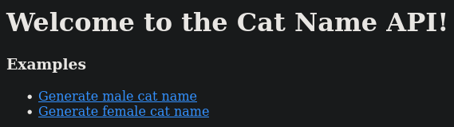
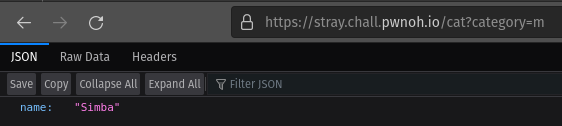
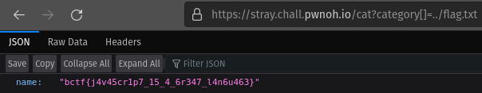

# Crypto challenges
## Table of contents
- [Stray (203 solves)](./web.md#stray)

## Stray
Stuck on what to name your stray cat?<br>
*link to the website*<br><br>
**Attachments**
- [export.zip]()
### Solution
Let's click on the website:<br>
<br>
I'll click on the first link and here is what we see:<br>
<br>
Ok. Let's check the code for this `/cat` endpoint in the `app.js` located in the archive:
```js
app.get("/cat", (req, res) => {
  let { category } = req.query;

  console.log(category);

  if (category.length == 1) {
    const filepath = path.resolve("./names/" + category);
    const lines = fs.readFileSync(filepath, "utf-8").split("\n");
    const name = lines[Math.floor(Math.random() * lines.length)];

    res.status(200);
    res.send({ name });
    return;
  }

  res.status(500);
  res.send({ error: "Unable to generate cat name" });
});
```
Ok so this is written in express, and it checks that the `category` parameter is of length 1.<br>
We know that `path.resolve` is the red flag for an [LFI (Local File Inclusion)](https://owasp.org/www-project-web-security-testing-guide/v42/4-Web_Application_Security_Testing/07-Input_Validation_Testing/11.1-Testing_for_Local_File_Inclusion).<br>
And, indeed, we can see in the unzipped archived that there is a `flag.txt`:<br>
<br>
So we want to send `../flag.txt` to the `category` parameter. But how to do this in only one character?...<br>
Or.. do we want one character? Maybe we want a list of length 1? Is it possible to do so?<br>
After some hours of research, I finally saw a website documenting Parameter Pollution in NodeJS. I scrolled a bit a found this table:<br>
<br>
So useful! So I tried to enter `https://stray.chall.pwnoh.io/cat?category[]=../flag.txt`:<br>
<br>
Interesting vulnerability!
#### Flag
`bctf{j4v45cr1p7_15_4_6r347_l4n6u463}`
