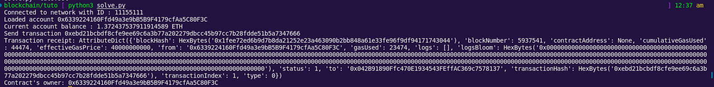
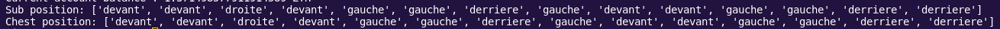

# Blockchain challenges
## Table of contents
- [Tuto blockchain (XX solves)](./blockchain.md#tuto-blockchain)
- [Lost Treasure (XX solves)](./blockchain.md#lost-treasure)
- [Keccak (XX solves)](./blockchain.md#keccak)
- [Keccak 2 (XX solves)](./blockchain.md#keccak2)

### Tuto blockchain
<!--
```
```
-->
**Attachements :**
- [tuto.sol](./sol_scripts/tuto.sol)

#### Solution
##### Introduction
This challenge is a little bit special as it is an introduction to blockchain in cybersecurity.<br>
I never did any blockchain until this CTF but I wanted to learn, but couldn't find any ressource accessible online.<br>
And here it is. The opportunity to learn. So let's dive into it!<br><br>
So I won't dive into the particularities of blockchain and how to create an account. What we have to know for now is that we're using MetaMask application, we're on Sepolia testnet as asked by the challenge, and we had some ETH through [Sepolia POW Faucet](https://sepolia-faucet.pk910.de/) (I had verified my legitimacy thanks to my GitHub account, fun fact in your face)<br>
<br>
So the first challenge is just asking us to deploy the given `TutoBlockchain` contract in `tuto.sol`, and then call `getOwnership` to begin the owner.<br>
As I like to learn things by myself, I did not want to do everything like the tutorial would teach us, so I implemented the solution of this challenge in Python, and that's why I'm writing this write-up.<br>
Everything about deploying the contract has been written on the challenge, you just need to use Remix IDE which is an online Solidity IDE that will compile and deploy your Solidity code. I won't develop much more here as it's not what I want to describe
##### Resolving the chall in Python
So, how do we do this in Python ?<br>
First of all, we will
```sh
pip install web3
```
install THE library to do web3 in python which is named... `web3`... How original<br>
Then we need to communicate with our crypto wallet. Well, to do this I found a service called [Infura](https://www.infura.io/). What I understood is that it's called an HTTP Provider and can do transactions and call functions of deployed contracts. So I created an account and retrieved my API Key.<br>
So first we need to connect to the provider.
```py
from web3 import Web3
import json

infuraAPIKey = ""
# This code is just used to recover safely my private api key
with open("../config.json", "r") as f:
    config = json.loads(f.read())
    infuraAPIKey = config["infura_apikey"]
    

w3 = Web3(Web3.HTTPProvider(f"https://sepolia.infura.io/v3/{infuraAPIKey}"))
print(f'Connected to network with ID : {w3.net.version}')
```
This little piece of code let us know if our provider is working and if we are indeed connected. Note that we are on the `sepolia` endpoint, because we are working on the Sepolia testnet.<br>
So what to do now ? Well, I need to login to my crypto wallet. To do this, I can retrieve my private key on MetaMask and put it in my `config.json`, and then use it to connect to my account.<br>

```py
from web3 import Account

priv_key = ""
with open("../config.json", "r") as f:
    config = json.loads(f.read())
    priv_key = config["eth_priv_key"]

account = Account.from_key(priv_key)
print(f'Loaded account {account.address}')

balance = w3.eth.get_balance(account.address)
print(f'Current account balance : {w3.from_wei(balance, "ether")} ETH')
```
So here, we check that we have loaded the right account by displaying its public address. Mine is `0x6339224160Ffd49a3e9bB5B9F4179cfAa5C80F3C`.<br>
We then check if we have ETH in our balance, as we will need it to do transactions. As I understood, fees are applied on each transaction so we need some. I have more than 1 SepoliaETH thanks to the faucet, so we will be good for the rest of the challenge (maybe the rest of my life...)<br>
Ok... so we have our account and we can interact with it! But.. interact with what exactly ?<br>
Well, the given solidity code is a contract, and we need to interact with it.<br>
During the challenge, we had to use a specific address to validate the flag. For me, this address was `0x042B91890Ffc470E1934543FEffAC369c7578137`. So I deployed it with Remix IDE.<br>
**Note:** You can check each contract with Etherscan, with the sepolia endpoint. [Here is my contract on Etherscan](https://sepolia.etherscan.io/address/0x042B91890Ffc470E1934543FEffAC369c7578137) so you can check what it looks like.<br>
Good, so everything is setup! We just need to have our python code to interact with it. But how to do so ?<br>
First we have to define a contract. In order to do it, we will use `w3.eth.contract(address, abi)`. So we have the contract `address` but what is its `abi` ?<br>
The ABI of a contract is a spec meant to make interactions with contracts easier. Basically, if you developed in C, it's a `.h`.<br>
And how do we know how it looks like ? Well Remix IDE is giving it when we compile our code. I won't describe it here but feel free to PM me to ask!<br>
So in the end, our contract in Python looks like :
```py
contract_address = "0x042B91890Ffc470E1934543FEffAC369c7578137"
contract_abi = [
        {
            "inputs": [],
            "stateMutability": "nonpayable",
            "type": "constructor"
        },
        {
            "inputs": [],
            "name": "getOwner",
            "outputs": [
                {
                    "internalType": "address",
                    "name": "",
                    "type": "address"
                }
            ],
            "stateMutability": "view",
            "type": "function"
        },
        {
            "inputs": [],
            "name": "getOwnership",
            "outputs": [],
            "stateMutability": "nonpayable",
            "type": "function"
        }
    ]

contract = w3.eth.contract(address=contract_address, abi=contract_abi)
```
In the `contract` variable we now have a python representation of our contract. So we can just call the function, something like `contract.getOwnership()` right ?<br>
haha, that's the neat part, you don't!<br>
In fact, `getOwnership` and `getOwner` are really, really different.<br>
`getOwner` is sending data, regardless of who is asking. Whereas `getOwnership` will not do the same thing if the sender of the request is me or you.<br>
What does that mean ? Well, to call `getOwner`, you can just have 1 little line of code :
```py
contract.functions.getOwner().call()
```
And this will do the work. However for `getOwnership`...<br>
Let's discover transactions!<br>
What are transactions ? Well, they're just requests that can send data about yourself and authentify that is indeed you sending it, as blockchain is meant to be super secure.<br>
So, how to do a transaction in python ? First we need to build it:
```py
transaction = contract.functions.getOwnership().build_transaction({
    'from': account.address,
    'nonce': w3.eth.get_transaction_count(account.address),
    'gas': 100000,
    'gasPrice': w3.to_wei('40', 'gwei'),
})
```
As far as I understand it, `gas` and `gasPrice` are the limit I set, but this will be decided by the process. Then the nonce is just here to avoid duplicates (as far as I understand it)<br>
Ok, so now we need to sign our transaction and send it:
```py
signed_transaction = w3.eth.account.sign_transaction(transaction, priv_key)
sent_transaction = w3.eth.send_raw_transaction(signed_transaction.rawTransaction)
print(f"Send transaction {sent_transaction.hex()}")
```
Ok so our transaction just has been sent, how exciting! But.. how do we know it has been indeed sent ?..<br>
So first wait 30 seconds to allow the transaction to exist, and then...<br>
Two solutions: either check on [EtherScan](https://sepolia.etherscan.io/address/0x042B91890Ffc470E1934543FEffAC369c7578137) or use these lines to have the transaction informations:
```py
sleep(30) # ici on attend 30 secondes avec time.sleep, pour éviter de relancer un autre script...
transaction_receipt = w3.eth.get_transaction_receipt(sent_transaction)
print(f"Transaction receipt: {transaction_receipt}")
```
It should've worked! Let's check by calling `getOwner()`:
```py
print(f"Contract's owner: {contract.functions.getOwner().call()}")
```
Let's check the results!<br>
<br>
So we can see that the owner is indeed my address. So we have validated the challenge, GG!<br>
Note: You can find full solution code in [solutions folder](./solutions/solve_tuto.py)

### Lost Treasure
<!--
```
```
-->
**Attachements :**
- [lost-treasure.sol](./sol_scripts/lost-treasure.sol)

#### Solution
Quick disclaimer: I won't describe how to use the web3 python library as I explained it in the [first blockchain challenge of this ctf](./blockchain.md#tuto-blockchain).<br>
So looking at the challenge description we need to access to the lost treasure, the chest. We can see in the solidity code that we can retrieve both the submarine and the chest position
```solidity
function getSubmarinePosition() public view returns (string[] memory) {
    return s_submarinePosition;
}

function getChestPosition() public view returns (string[] memory) {
    return s_chestMap;
}
```
We also see that the directions to take are hardcoded in the contract but let's pretend we didn't see anything.<br>
So to begin with, I'll retrieve chest and submarine position in Python.<br>
In order to do this, I'm first deploying the contract with Remix IDE on the address [0x6c73dF1F981C02177D2CB75134121B3392A03cE3](https://sepolia.etherscan.io/address/0x6c73dF1F981C02177D2CB75134121B3392A03cE3)<br>
Then, I'm setting up my account and the contract with the ABI given by Remix IDE
```py
# [...]
# there is the regular code to access to the sepolia testnet before

contract_address = "0x6c73dF1F981C02177D2CB75134121B3392A03cE3"
contract_abi = [
        {
            "inputs": [],
            "name": "getChestPosition",
            "outputs": [
                {
                    "internalType": "string[]",
                    "name": "",
                    "type": "string[]"
                }
            ],
            "stateMutability": "view",
            "type": "function"
        },
        {
            "inputs": [],
            "name": "getSubmarinePosition",
            "outputs": [
                {
                    "internalType": "string[]",
                    "name": "",
                    "type": "string[]"
                }
            ],
            "stateMutability": "view",
            "type": "function"
        },
        {
            "inputs": [],
            "name": "goBackward",
            "outputs": [],
            "stateMutability": "nonpayable",
            "type": "function"
        },
        {
            "inputs": [],
            "name": "goForward",
            "outputs": [],
            "stateMutability": "nonpayable",
            "type": "function"
        },
        {
            "inputs": [],
            "name": "goLeft",
            "outputs": [],
            "stateMutability": "nonpayable",
            "type": "function"
        },
        {
            "inputs": [],
            "name": "goRight",
            "outputs": [],
            "stateMutability": "nonpayable",
            "type": "function"
        },
        {
            "inputs": [],
            "name": "resetPosition",
            "outputs": [],
            "stateMutability": "nonpayable",
            "type": "function"
        },
        {
            "inputs": [],
            "name": "undoMoving",
            "outputs": [],
            "stateMutability": "nonpayable",
            "type": "function"
        }
    ]

contract = w3.eth.contract(address=contract_address, abi=contract_abi)
```
Great! Now I need to get the chest and submarine position
```py
sub_pos = contract.functions.getSubmarinePosition().call()
chest_pos = contract.functions.getChestPosition().call()
```
This will give us the output
```py
sub_pos = []
chest_pos = [
    "devant",
    "devant",
    "droite",
    "devant",
    "gauche",
    "gauche",
    "derriere",
    "gauche",
    "devant",
    "devant",
    "gauche",
    "gauche",
    "derriere",
    "derriere"
]
```
What to do now ? Well, I guessed you needed to have the submarine at the same place of the chest. Which basically means `sub_pos == chest_pos`<br>
But we can't modify the sub_pos just like this, we need to use the functions given to us. Basically, we will use the functions that adds a string to the submarine position.<br>
If we were to translate what I said in Python, we would use a `match` case (or a `switch` case, it's just the keyword that changes)
```py
for pos in chest_pos:
    print(pos)
    contractFunc = None
    match pos:
        case "devant":
            contractFunc = contract.functions.goForward()
        case "derriere":
            contractFunc = contract.functions.goBackward()
        case "droite":
            contractFunc = contract.functions.goRight()
        case "gauche":
            contractFunc = contract.functions.goLeft()
```
So for each direction possible, I'm "translating" it to its contract function.<br>
From there, I just have to build, sign and send the transaction.
```py
    transaction = contractFunc.build_transaction({
        'from': account.address,
        'nonce': w3.eth.get_transaction_count(account.address),
        'gas': 100000,
        'gasPrice': w3.to_wei('40', 'gwei'),
    })

    signed_txn = w3.eth.account.sign_transaction(transaction, priv_key)

    sent_transaction = w3.eth.send_raw_transaction(signed_txn.rawTransaction)

    print(f"Send transaction {sent_transaction.hex()}")
```
And then, check the transaction has been set and processed
```py
    sleep(30) # from time import sleep. This is important because the transaction takes time to appear

    transaction_receipt = w3.eth.get_transaction_receipt(sent_transaction)
    print(f"Transaction receipt: {transaction_receipt}")
```
Great! We can then just verify that `sub_pos == chest_pos`
```py
sub_pos = contract.functions.getSubmarinePosition().call()
chest_pos = contract.functions.getChestPosition().call()

print(f"Sub position: {sub_pos}\nChest position: {chest_pos}")
```
Let's see...<br>
<br>
It's indeed the same, the challenge has been cleared!<br>
Note: You can find full solution code in [solutions folder](./solutions/solve_lost-treasure.py)
